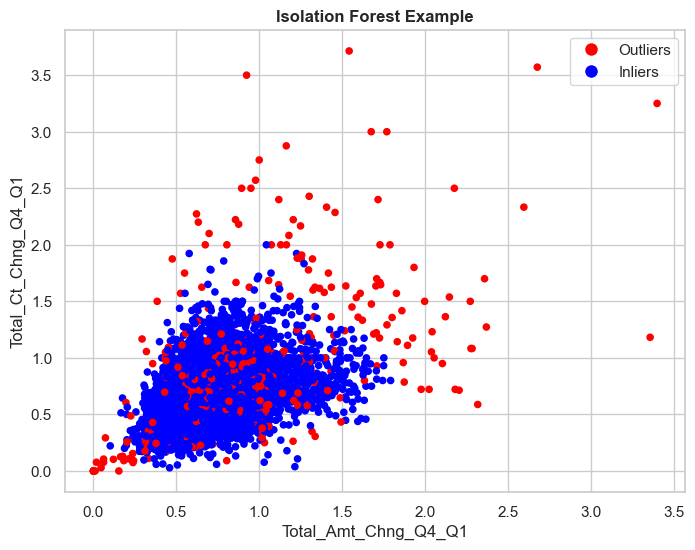

# Welcome to my project on Customer Segmentation and Churn Prediction!

### In this project, I utilized Machine Learning techniques to achieve the following results:

## Clustering:

| Metric                  | Value                  |
|-------------------------|------------------------| 
| Inertia                 | 4278.43                |  
| Silhouette Score        | 0.3088                 | 
| Calinski Harabasz Score | 2978.44                |
| Davies Bouldin Score    | 1.3723                 |                                                                                

## Churn Prediction:

| Model                     | Class 1 Recall | Class 1 F1 | Accuracy |
|---------------------------|----------------|------------|----------|
| Base Logistic Regression  | 0.84           | 0.65       | 0.85     |
| Base Random Forest        | 0.83           | 0.85       | 0.95     |
| Base XGBoost              | 0.89           | 0.91       | 0.97     |
| Base LightGBM             | 0.89           | 0.9        | 0.97     |
| Best Logistic Regression  | 0.91           | 0.46       | 0.65     |
| Best Random Forest        | 0.84           | 0.86       | 0.96     |
| Best XGBClassifier        | 0.92           | 0.87       | 0.96     |
| Best LightGBMClassifier   | 0.89           | 0.86       | 0.95     |
| Best XGBClassifier Tuned  | 0.89           | 0.86       | 0.95     |
| Best LGBMClassifier Tuned | 0.89           | 0.87       | 0.96     |
| Ensemble Base Models      | 0.89           | 0.9        | 0.97     |
| Ensemble Tuned Models     | 0.9            | 0.89       | 0.96     |
| Ensemble XGB Models       | 0.89           | 0.9        | 0.97     |

# Let's see how I did it!

## Tools and Libraries Used:
- Pandas
- NumPy
- SciPy
- Matplotlib
- Seaborn
- Scikit-learn
- Imbalanced-learn
- XGBoost
- LightGBM

# Data: 
### For this project, I used data directly from Kaggle without doing any data collection myself. Below are the links for the dataset:

- [Original Dataset](https://zenodo.org/records/4322342#.Y8OsBdJBwUE)
- [Dataset on Kaggle](https://www.kaggle.com/datasets/thedevastator/predicting-credit-card-customer-attrition-with-m)

# EDA:
### During Exploratory Data Analysis, I delved deep into the data performing univariate, bivariate, and multivariate analysis, in which I identified a lot of outliers in four of the columns, as seen below:

# Outlier Detection and Handling:
### For detecting the outliers, I used an ensemble technique using:
- Modified Z-score
- IQR
- Isolation Forest

#### Zscore was not used because of the high skewness these variables had.

### After running the models with and without outliers, it turned out performance was better if no outlier handling was done.

# Data Preprocessing:

### During this stage, I made sure to avoid data leakage by creating my train, evaluation, and test datasets before doing any preprocessing. This process was done in the following steps:

1. **Data Imputing:** Replaced 'Unknown' values in three columns with the mode of the columns (Reduced model complexity and results were improved slightly).
2. **Feature Engineering:** Experimented with creating/categorizing features to improve model performance.
**Feature Transformations:** Applied transformations to columns to reduce skewness. Example implementation:

4. **Encoding:** Label encoded variables with a real-life order to them and One-Hot-Encoded purely categorical ones.
5. **Scaling:** Utilized sklearn MinMaxScaler for scaling all numerical variables.
6. **Feature Selection:** In this stage, I tried to reduce dimensionality using techniques such as correlations, dendrogram analysis, and variance threshold.
- Correlations 

- Dendrogram Analysis

- Variance Threshold

# Clustering:

### Models used:
- KMeans
- AgglomerativeClustering 
- DBSCAN

### Ended up using KMeans due to simplicity, since all of them had similar performance.

### Evaluation Metrics:
- Inertia
- Silhouette Score
- Calinski-Harabasz Score
- Davies-Bouldin Score

### Optimal number of clusters turned out to be 4.

### After a lot of iteration, it turned out that clustering results were not adequate to be used for further analysis, but some noteworthy insights arose from the whole process(Check out the code for more!)

### Mean Feature Values for each cluster:

# Customer Churn:
### Before fitting the model, SMOTE was applied because the target variable was imbalanced.

### Models used:
- LogisticRegression
- RandomForest 
- XGBClassifier
- LGBMClassifier
- Ensemble techniques with the above models

### Evaluation Metrics:
- Precision
- Recall
- F1-score
- Accuracy

### Due to the nature of the problem, more emphasis was given on Recall. Finally, I managed to achieve over 90% recall with a 97% overall accuracy!

## Thank you for sticking around! Feel free to contact me for any questions.

[Connect with me on LinkedIn](https://www.linkedin.com/in/kongiannopoulos/)

[Check out my Kaggle Profile](https://www.kaggle.com/giannopouloskon)